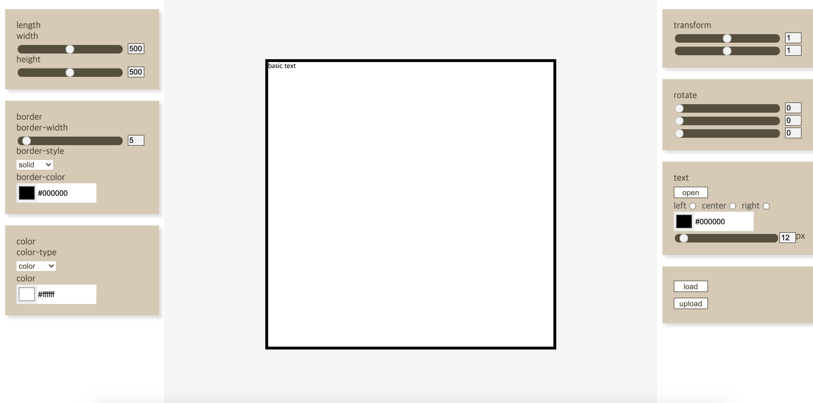
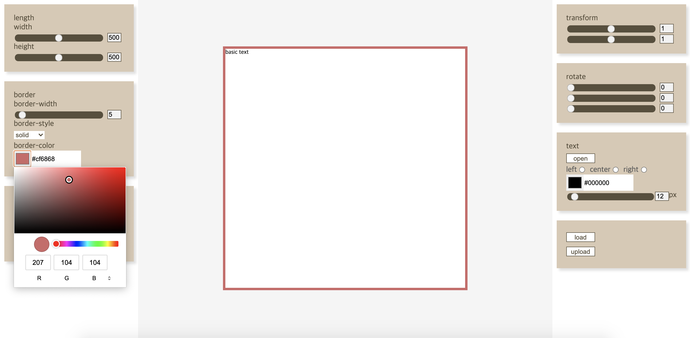
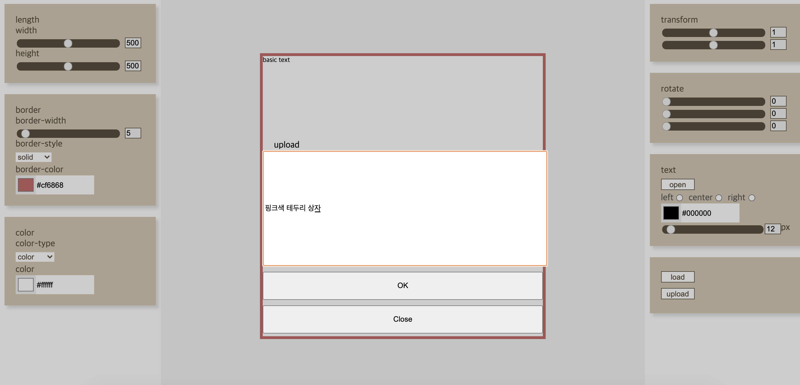

# Css converter for React practice

#### 기능

1. 가로 세로 길이 설정
2. 테투리 모양 및 색상 설정
ex) 
3. 배경 색상 설정
4. 박스 안 텍스트 입력
5. 텍스트 색상 설정
6. X축 Y축 Z축 기준 변환
7. 가로 세로 비율 변경
8. Frame 추가
9. 제작한 프레임으로 애니메이션 제작
10. 프레임 업로드 및 로드
ex) 
